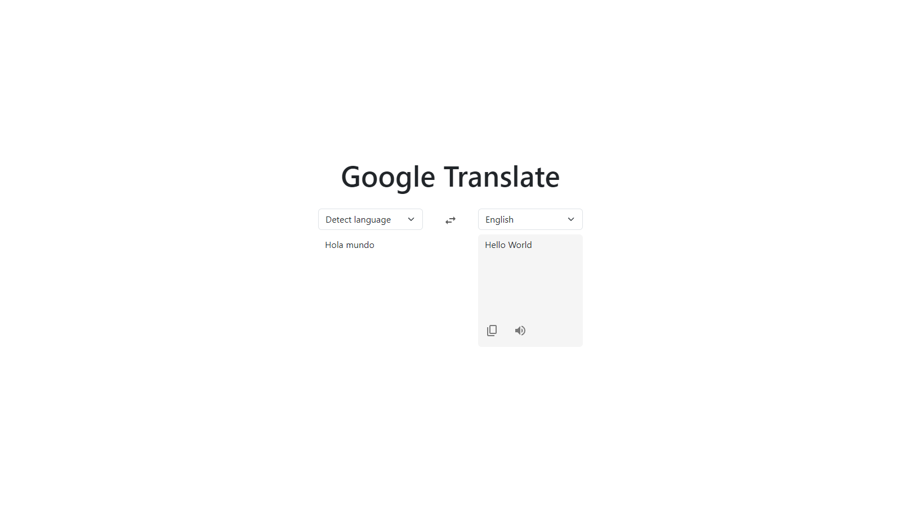

# Google Translate Clone

## Description

This is a clone of Google Translate. It is a simple web application that allows users to translate text from one language to another. It uses the Opean AI API to translate the text. The application is built with React and styled with Bootstrap.

## Screenshot

## Features

-   Users can translate text from one language to another.
-   Users can select the language they want to translate to.
-   Users can select the language they want to translate from.
-   Users can copy the translated text to their clipboard.
-   Users can listen to the translated text.

## Technologies

-   [React](https://reactjs.org/): A JavaScript library for building user interfaces.
-   [Bootstrap](https://getbootstrap.com/): A CSS framework directed at responsive, mobile-first front-end web development.
-   [Open AI API](https://openai.com/): The API of GPT, a neural network trained to write human-like text by completing sentences.
-   [Vitest](https://vitest.dev): A tool for testing your website's accessibility.

## Available Scripts

In the project directory, you can run:

-   `npm run dev`: Runs the app in the development mode.
-   `npm run build`: Builds the app for production to the `dist` folder.
-   `npm run test`: Launches the test runner.
-   `npm run deploy`: Deploys the app to GitHub Pages.

## Deployment

[Google Translate Clone](https://amv1909.github.io/google-translate-clone/)
